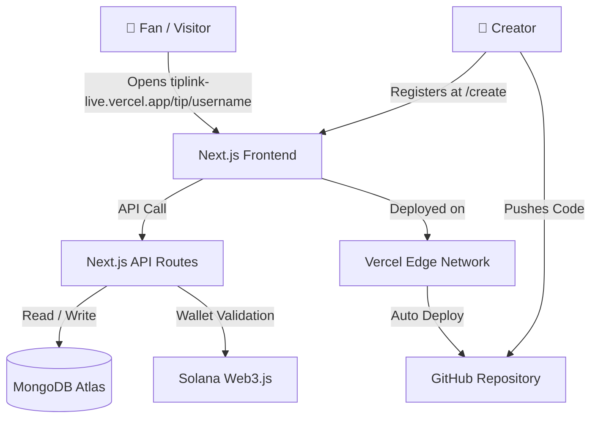
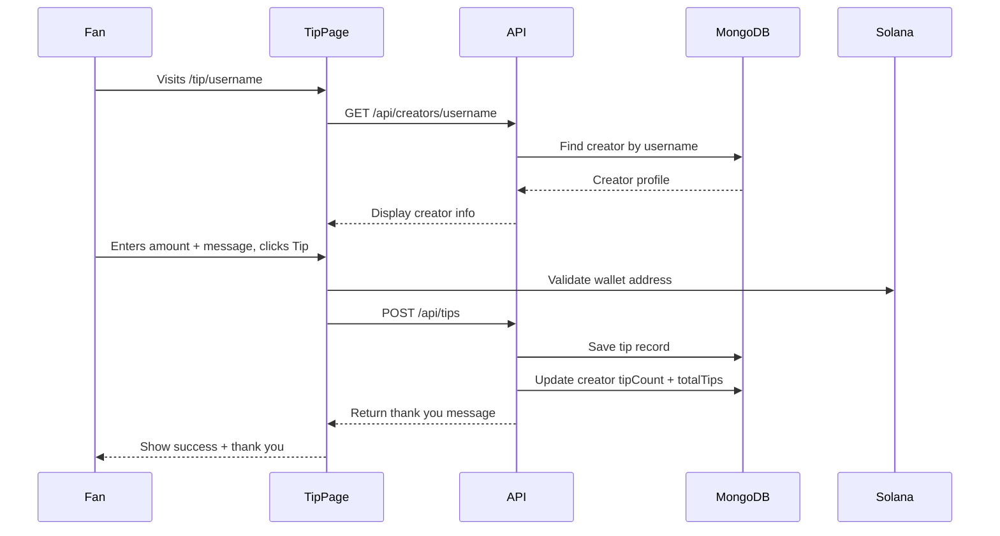

# ⚡ TipLink Live

> **The Creator Economy, Powered by Solana.**

TipLink Live is a decentralized creator tipping platform built on Solana. Creators set up a personal page with their username, bio, and Solana wallet address. Fans visit that page and send SOL tips directly — no middleman, no platform cut, instant settlement.

🌐 **Live App:** [https://tiplink-live.vercel.app](https://tiplink-live.vercel.app)

---

## 📸 What It Looks Like

| Page | Description |
|------|-------------|
| `/` | Landing page with hero, stats, and feature highlights |
| `/create` | Creator registration form |
| `/explore` | Browse all registered creators |
| `/tip/[username]` | Fan-facing tip page for each creator |
| `/dashboard` | Creator's personal tip history and earnings |

---

## 🚀 Tech Stack

| Layer | Technology |
|-------|------------|
| Framework | Next.js 14 (App Router) |
| Language | TypeScript |
| Styling | Tailwind CSS + Glassmorphism UI |
| Animations | Framer Motion |
| Icons | Lucide React |
| Blockchain | Solana (`@solana/web3.js`) |
| Database | MongoDB Atlas |
| Deployment | Vercel |
| CI/CD | GitHub → Vercel (Auto Deploy) |

---

## 🏗️ System Architecture



---

## 🗂️ Project Folder Structure

```
tiplink-live/
├── src/
│   ├── app/
│   │   ├── page.tsx                    # Landing Page
│   │   ├── layout.tsx                  # Root Layout
│   │   ├── globals.css                 # Global Styles
│   │   ├── create/
│   │   │   └── page.tsx                # Creator Registration
│   │   ├── explore/
│   │   │   └── page.tsx                # Explore All Creators
│   │   ├── dashboard/
│   │   │   └── page.tsx                # Creator Dashboard
│   │   ├── tip/
│   │   │   └── [username]/
│   │   │       └── page.tsx            # Fan Tip Page (Dynamic Route)
│   │   └── api/
│   │       ├── creator/route.ts        # Create / Get Creator
│   │       ├── creators/
│   │       │   ├── [username]/route.ts # Get Creator by Username
│   │       │   └── by-wallet/[wallet]/ # Get Creator by Wallet
│   │       ├── tips/
│   │       │   ├── route.ts            # Create / Get All Tips
│   │       │   ├── [username]/route.ts # Tips by Username
│   │       │   └── by-wallet/[wallet]/ # Tips by Wallet
│   │       ├── thankyou/route.ts       # Generate Thank You Message
│   │       ├── stats/route.ts          # Platform Stats
│   │       └── seed/route.ts           # Seed Demo Data
│   └── lib/
│       ├── storage.ts                  # MongoDB CRUD Layer
│       └── solana.ts                   # Solana Utility Helpers
├── public/                             # Static Assets
├── .env.example                        # Environment Variable Template
├── next.config.js                      # Next.js Config
├── tailwind.config.ts                  # Tailwind Config
└── tsconfig.json                       # TypeScript Config
```

---

## 🔄 Data Flow — How a Tip Works



---

## 🗄️ Database Schema

### Creator Collection
```json
{
  "_id": "ObjectId",
  "username": "devcoder",
  "displayName": "Dev Coder",
  "bio": "Building cool stuff and teaching developers.",
  "walletAddress": "7xKXtg2CW87d97TXJSDpbD5jBkheTqA83TZRuJosgAsU",
  "avatarUrl": "https://example.com/avatar.png",
  "tipCount": 42,
  "totalTips": 8.5,
  "createdAt": "2026-06-14T00:00:00.000Z"
}
```

### Tips Collection
```json
{
  "_id": "ObjectId",
  "senderAddress": "9WzDXwBbmkg8ZTbNMqUxvQRAyrZzDsGYdLVL9zYtAWWM",
  "recipientUsername": "devcoder",
  "amount": 0.5,
  "message": "Love your tutorials!",
  "txSignature": "mock_1718345600000",
  "createdAt": "2026-06-14T00:00:00.000Z"
}
```

---

## 📡 API Routes Reference

| Method | Endpoint | Description |
|--------|----------|-------------|
| `POST` | `/api/creator` | Register a new creator |
| `GET` | `/api/creator?username=x` | Get creator by username |
| `GET` | `/api/creators` | List all creators |
| `GET` | `/api/creators/[username]` | Get single creator |
| `GET` | `/api/creators/by-wallet/[wallet]` | Get creator by wallet |
| `POST` | `/api/tips` | Submit a tip |
| `GET` | `/api/tips` | Get all tips |
| `GET` | `/api/tips/[username]` | Get tips for a creator |
| `GET` | `/api/tips/by-wallet/[wallet]` | Get tips sent by wallet |
| `GET` | `/api/thankyou` | Generate thank you message |
| `GET` | `/api/stats` | Get platform stats |

---

## ⚙️ Local Setup

### 1. Clone the repo
```bash
git clone https://github.com/gopichandchalla16/tiplink-live.git
cd tiplink-live
```

### 2. Install dependencies
```bash
npm install
```

### 3. Set up environment variables
```bash
cp .env.example .env.local
```

Fill in your `.env.local`:
```env
MONGODB_URI=mongodb+srv://<username>:<password>@cluster.mongodb.net/tiplink
```

### 4. Run the dev server
```bash
npm run dev
```

Open [http://localhost:3000](http://localhost:3000) in your browser.

---

## 🚀 Deployment

This project is deployed on **Vercel** with GitHub CI/CD.

Every push to `main` triggers an automatic production deployment.

```bash
# Manual deploy
vercel --prod --force
```

Environment variable required on Vercel:
```
MONGODB_URI = your MongoDB Atlas connection string
```

---

## 🧱 Key Technical Decisions

### Why Next.js App Router?
The App Router allows both server-side rendering and API routes in a single project. Pages like `/tip/[username]` are dynamic server-rendered routes that fetch creator data at request time, making each tip page SEO-friendly and fast.

### Why MongoDB Atlas?
MongoDB's flexible document model is perfect for storing creator profiles and tip records that may evolve over time. Atlas provides a fully managed cloud database with free tier support, making it ideal for hackathon-scale deployments.

### Why Solana?
Solana offers sub-second transaction finality and extremely low fees (fractions of a cent), making it the best blockchain for microtransactions like tips. The `@solana/web3.js` library handles wallet address validation and SOL unit conversion.

### Why Vercel?
Vercel is purpose-built for Next.js deployments. It automatically detects the framework, handles serverless function routing, and provides a global CDN edge network — zero config needed.

---

## 🐛 Debugging Story

During deployment, the Vercel build kept failing with:
```
Attempted import error: 'getCreatorByUsername' is not exported from '@/lib/storage'
```

The root cause: API routes were importing functions (`getAllTips`, `recordTip`, `getTipsForCreator`, `isValidSolanaAddress`) that didn't exist in `storage.ts` or didn't exist at all (`solana.ts` was missing).

**Fix:** Rewrote `storage.ts` with all required exports and backward-compatible aliases, and created `src/lib/solana.ts` from scratch with the missing utility functions. Deployed clean with `vercel --prod --force` to bypass the stale build cache.

---

## 👤 Built By

**Gopichand Challa**
- 🐦 X (Twitter): [@GopichandAI](https://x.com/GopichandAI)
- 💻 GitHub: [github.com/gopichandchalla16](https://github.com/gopichandchalla16)
- 🔗 LinkedIn: [linkedin.com/in/gopichandchalla](https://linkedin.com/in/gopichandchalla)

---

## 📄 License

MIT License — feel free to fork, build, and ship.

---

<div align="center">
  <strong>Built on Solana · Deployed on Vercel · Made with ❤️ for creators</strong>
</div>
