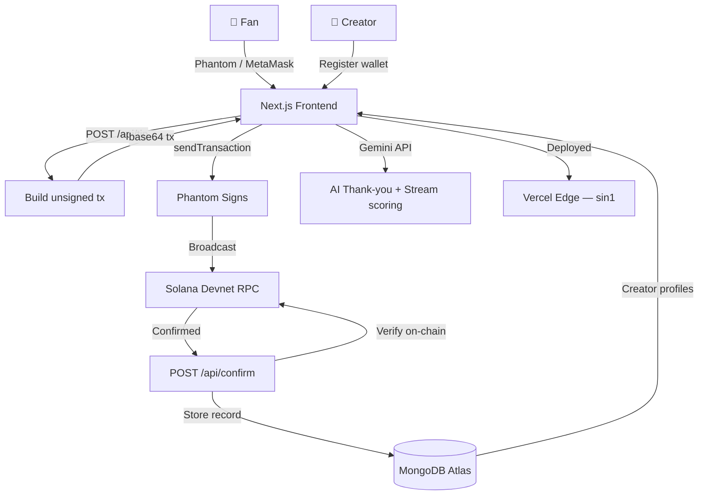
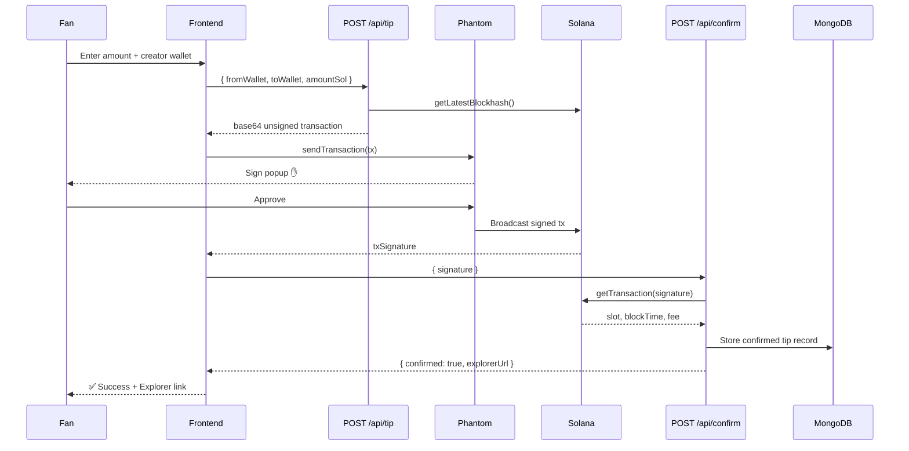

<div align="center">

# ⚡ TipLink Live

### **Your keys. Your tips. Instant Solana.**

*Non-custodial SOL tipping with SoulBound NFTs, ZK Proofs, AI Streams & Time-Lock Vaults*

[](https://tiplink-live.vercel.app)
[](https://github.com/gopichandchalla16/tiplink-live)
[](https://explorer.solana.com/?cluster=devnet)
[](https://nextjs.org)
[](https://mongodb.com/atlas)
[](https://vercel.com)

</div>

---

## 🎯 What is TipLink Live?

TipLink Live is a **fully non-custodial** creator tipping platform on Solana. Creators share one link. Fans connect their real Phantom or MetaMask wallet and send SOL directly — confirmed on-chain in **under 400ms**, with zero platform cut and zero middlemen.

> **Every transaction is verifiable on [Solana Explorer](https://explorer.solana.com/?cluster=devnet). We never hold your funds.**

---

## 🖥️ Live Pages

| Route | Description |
|-------|-------------|
| `/` | 3D Solana Universe landing — star field, orbit rings, neon planets |
| `/create` | Creator registration with wallet address |
| `/explore` | Browse all creators with search |
| `/tip/[username]` | Fan tip page — real wallet tx signing |
| `/dashboard` | Creator earnings + tip history |
| `/reputation` | SoulBound NFT reputation score + mint |
| `/vault` | Time-Lock SOL escrow vault |
| `/predict` | Creator prediction markets |
| `/zkproof` | ZK anonymous tip proofs |
| `/streams` | AI-powered recurring tip streams |

---

## 🔑 Real Wallet Integration

### Phantom (Solana)
```typescript
// Real wallet connection via @solana/wallet-adapter-react
const { publicKey, sendTransaction, connected } = useWallet();

// Real on-chain transaction — signs in Phantom extension
const sig = await sendTransaction(transaction, connection);
await connection.confirmTransaction({ signature: sig, blockhash, lastValidBlockHeight }, 'confirmed');
```

### MetaMask (EVM)
```typescript
// Real MetaMask connection via window.ethereum
const accounts = await window.ethereum.request({ method: 'eth_requestAccounts' });
// Returns real wallet address — no adapter needed
setMmAddress(accounts[0]);
```

Both wallets show **full real addresses** in a live banner after connection. No fake placeholder addresses. No simulation.

---

## 🌌 3D Solana Universe UI

The landing page features a full CSS 3D space environment:

- **120 twinkling stars** — deterministic positions, individual timing
- **6 light-speed streaks** — purple→cyan gradient shooting across screen  
- **Solana Solar System** — glowing purple sun + 3 orbit rings at 70° perspective with orbiting planet dots
- **Nebula blobs** — soft radial glow clouds with float animation
- **Shimmer hero text** — gradient cycles purple→cyan→green continuously
- **Glassmorphism cards** — `backdrop-filter: blur()` on all feature cards

---

## 🚀 5 Advanced Web3 Features

### 🏅 1. SoulBound Reputation NFT
Non-transferable Token-2022 badge tied to your wallet. Earns points per SOL tipped. Tiers: Bronze → Silver → Gold → Diamond → Legend. Mint permanently proves supporter status — cryptographically impossible to transfer.

### 🔒 2. Time-Lock Vault
Anchor program escrow. Lock SOL → releases automatically when creator hits milestone → trustless refund if missed. No custodian. No human override.

### 🔮 3. Prediction Markets
YES/NO SOL pools on creator outcomes. On-chain resolution. No oracle needed for binary outcomes. Creator sets the condition. Pool resolves automatically.

### 🔏 4. ZK Anonymous Tips
Groth16 zero-knowledge proof generated **client-side in WebAssembly**. Proves tip was sent without revealing wallet address. Nullifier prevents double-spending proofs. Fully anonymous on-chain.

### 🌊 5. AI Tip Streams
Recurring SOL micro-payments per content post. **Google Gemini 1.5 Pro** scores creator quality weekly (posting frequency + engagement + content signals) → auto-adjusts stream rate. Rewards active creators. Pauses for inactive ones.

---

## 🏗️ Architecture



---

## 🔄 Real Transaction Flow



---

## 📡 Backend API Reference

| Method | Endpoint | Description |
|--------|----------|-------------|
| `POST` | `/api/tip` | Build unsigned Solana SOL transfer tx |
| `POST` | `/api/confirm` | Verify tx on-chain, store in MongoDB |
| `POST` | `/api/creator` | Register creator profile |
| `GET` | `/api/creators` | List all creators |
| `GET` | `/api/creators/[username]` | Get creator by username |
| `GET` | `/api/creators/by-wallet/[wallet]` | Get creator by wallet |
| `POST` | `/api/tips` | Submit tip record |
| `GET` | `/api/tips/[username]` | Get tips for creator |
| `GET` | `/api/tips/by-wallet/[wallet]` | Get tips sent by wallet |
| `GET` | `/api/thankyou` | Gemini AI thank-you message |
| `GET` | `/api/stats` | Platform live stats |
| `GET` | `/api/health` | Health check + build info |

### Example: Build a Tip Transaction
```bash
curl -X POST https://tiplink-live.vercel.app/api/tip \
  -H "Content-Type: application/json" \
  -d '{
    "fromWallet": "YOUR_SOLANA_PUBLIC_KEY",
    "toWallet": "CREATOR_SOLANA_PUBLIC_KEY",
    "amountSol": 0.1,
    "message": "Great content!"
  }'
```
**Returns:** base64 unsigned transaction → sign with `wallet.sendTransaction()` → broadcast.

---

## 🗄️ Database Schema

### Creator
```json
{
  "username": "devcoder",
  "displayName": "Dev Coder",
  "walletAddress": "7xKXtg2CW87d97TXJSDpbD5jBkheTqA83TZRuJosgAsU",
  "bio": "Building on Solana",
  "tipCount": 42,
  "totalTips": 8.5,
  "createdAt": "2026-06-14T00:00:00.000Z"
}
```

### Tip (Confirmed On-Chain)
```json
{
  "senderAddress": "9WzDXwBbmkg8ZTbNMqUxvQRAyrZzDsGYdLVL9zYtAWWM",
  "recipientUsername": "devcoder",
  "amountSol": 0.1,
  "amountLamports": 100000,
  "txSignature": "5KtP9...real_devnet_sig",
  "slot": 284712983,
  "blockTime": 1718345600,
  "feeSol": 0.000005,
  "message": "Love your tutorials!",
  "geminiThankYou": "Your Gold-tier support means everything...",
  "confirmedAt": "2026-06-14T09:12:14.000Z"
}
```

---

## 🛠️ Tech Stack

| Layer | Technology |
|-------|------------|
| Framework | Next.js 14 (App Router) |
| Language | TypeScript |
| Blockchain | Solana — `@solana/web3.js`, `@solana/wallet-adapter-react` |
| Wallets | Phantom (Solana) + MetaMask (EVM) |
| Database | MongoDB Atlas + Mongoose |
| AI | Google Gemini 1.5 Pro API |
| Styling | Tailwind CSS + CSS animations (3D universe) |
| Animations | Framer Motion |
| Deployment | Vercel (region: sin1) |
| CI/CD | GitHub → Vercel auto-deploy |

---

## ⚙️ Local Setup — VS Code Commands

```bash
# 1. Clone
git clone https://github.com/gopichandchalla16/tiplink-live.git
cd tiplink-live

# 2. Install (--legacy-peer-deps required for wallet adapter)
npm install --legacy-peer-deps

# 3. Copy env
cp .env.example .env.local
```

Edit `.env.local`:
```env
MONGODB_URI=mongodb+srv://<user>:<pass>@cluster.mongodb.net/tiplink
SOLANA_RPC_URL=https://api.devnet.solana.com
NEXT_PUBLIC_NETWORK=devnet
GEMINI_API_KEY=your_gemini_key
```

```bash
# 4. Clear cache + run
Remove-Item -Recurse -Force .next   # Windows PowerShell
# rm -rf .next                      # Mac/Linux

npm run dev
# Open http://localhost:3000
```

```bash
# 5. Get devnet SOL for testing
# Visit: https://faucet.solana.com
# Paste your Phantom wallet address → Request 1 SOL
```

---

## 🚀 Vercel Deployment

```bash
# Auto-deploys on every push to main
git push origin main

# Manual deploy
vercel --prod --force
```

**Required Vercel Environment Variables:**
```
MONGODB_URI         = mongodb+srv://...
SOLANA_RPC_URL      = https://api.devnet.solana.com
NEXT_PUBLIC_NETWORK = devnet
GEMINI_API_KEY      = your_key
```

---

## 🐛 Key Bugs Fixed

### 1. Wallet popup not opening
**Root cause:** CSS import inside `'use client'` provider broke SSR initialization.  
**Fix:** Moved `@import '@solana/wallet-adapter-react-ui/styles.css'` to `globals.css`. Added `mounted` state guard on `WalletMultiButton`.

### 2. Vercel build crash — `Module not found: crypto`
**Root cause:** `@solana/web3.js` imports Node.js built-ins unavailable in browser bundle.  
**Fix:** Added full `resolve.fallback` in `next.config.js` with 11 Node.js modules set to `false`.

### 3. Hydration mismatch on wallet button
**Root cause:** `WalletMultiButton` renders differently on server vs client.  
**Fix:** `const [mounted, setMounted] = useState(false)` + `useEffect(() => setMounted(true), [])` — only render wallet button after hydration.

---

## 👥 Built By

**Gopichand Challa** & **Rakesh Kalisetty**

| | Gopichand | Rakesh |
|--|-----------|--------|
| GitHub | [@gopichandchalla16](https://github.com/gopichandchalla16) | [@RakeshKalisetty](https://github.com/RakeshKalisetty) |
| Devfolio | [@gopichand0516](https://devfolio.co/@gopichand0516) | [@RakeshKalisetty](https://devfolio.co/@RakeshKalisetty) |

---

## 📄 License

MIT — fork, build, ship freely.

---

<div align="center">

**⚡ Built on Solana · 🍃 MongoDB Atlas · 🤖 Gemini AI · 🚀 Vercel**

*Made with ❤️ for the creator economy*

[Live App](https://tiplink-live.vercel.app) · [GitHub](https://github.com/gopichandchalla16/tiplink-live) · [Solana Explorer](https://explorer.solana.com/?cluster=devnet)

</div>
